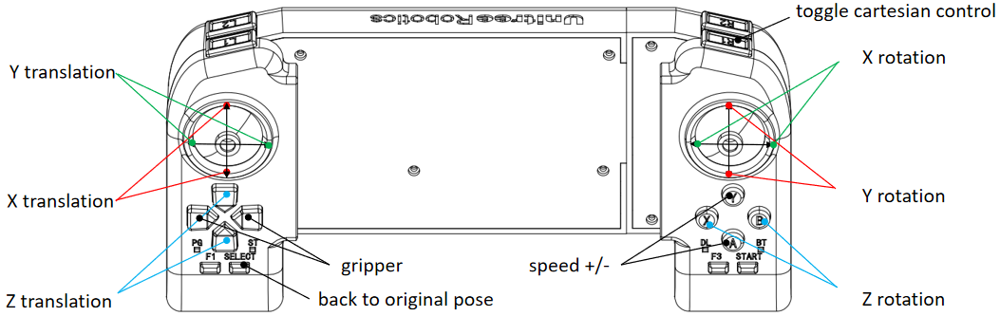

# obelisk-examples
A repo where we can hold examples using obelisk.

# Running the D1 Arm Python example
Make sure the XBox controller is plugged in; otherwise, it may not be detected
after the dev container is built.

Do initial setup of environment variables exposed to Docker:
```
bash setup.sh
```
Start the docker container:
```
cd docker

# No GPU
docker compose -f docker-compose-no-gpu.yml run --build obelisk_examples

# GPU
docker compose -f docker-compose.yml run --build obelisk_examples
```
Source base ROS, build Obelisk, activate Obelisk settings, and source Obelisk using one command:
```
obk
```

In the workspace (i.e. in `obelisk_examples`) build this package:
```
# build only 1 package
colcon build --symlink-install --parallel-workers $(nproc) --packages-select d1_control

# build all dummy packages
colcon build --symlink-install --parallel-workers $(nproc)
```
Source the generated bash script after building:
```
source install/setup.bash
```
Now we can launch the stack:
```
# in simulation
obk-launch config_file_path="${OBELISK_EXAMPLES_ROOT}/d1_control/configs/d1_sim.yaml" device_name=onboard bag=false 

# on hardware
obk-launch config_file_path="${OBELISK_EXAMPLES_ROOT}/d1_control/configs/d1_hardware.yaml" device_name=onboard bag=false 
```

# Setting up the Xbox remote
You can make sure that you can see the remote control with
```
sudo evtest
```

Then you can run
```
sudo chmod 666 /dev/input/eventX
```
where `X` is the number that you saw from evtest.

Then we can verify that ROS2 can see it with:
```
ros2 run joy joy_enumerate_devices
```
If ROS2 can see the controller, but not read in the values, verify that
the controller can connect to https://hardwaretester.com/gamepad.

# Joystick Mapping:
We use a Microsoft Xbox Series S|X Controller as our joystick.
Unitree uses their custom controller for their Z1 arm.
We mapped the Xbox controller to match the custom controller as much as possible.


However, since the controllers have different buttons, our mapping differs from
the one above in four cases. 
1. We do not toggle cartesian control using R1
2. Press the START button (three horizontal lines) to bring the arm to its initial pose
3. Press the BACK button to emergency-stop the arm
4. Press the SHARE button to command the arm to achieve a goal pose. 
(Only works when DEFAULT_MODE = Mode.SETTING_GOAL)

# How to control the arm
The stack has a DEFAULT_MODE (Mode.WAITING and Mode.SETTING_GOAL) specified in constants.py. 
Both modes work in the Mujoco simulation (which can be launched with d1_sim.yaml), 
however, the arm has hardware issues, so neither modes will work when launching
d1_hardware.yaml. 

### Mode.WAITING: 
- The robot is stationary unless the joystick commands the tip to
move in the x-y-z direction, rotate about the x-y-z axes, modify its gripper 
position, or reinitialize. 
- This default mode doesn't work well on hardware because the joystick commands
a new goal at the control frequency (10 Hz).
The arm cannot execute commands this quickly even though the Unitree documentation
states that the control cycle is 10 Hz. Thus, the arm fails to achieve the commanded
servo positions and doesn't execute any commands after a few minutes. 

### Mode.SETTING_GOAL
- Once the stack is launched, you can view the arm and a 
goal frame in Foxglove. The joystick moves the goal frame in the x-y-z direction and 
rotates it about the x-y-z axes of the goal frame. The joystick can
control the gripper position, reinitialize the robot, and emergency-stop the robot.
Once the goal frame is in the desired pose, the user can command the arm to move
joint `JOINT_ID` to this pose by hitting the joystick's SHARE button.
- Since the robot receives less commands, the user can operate the robot for a
longer duration before it starts failing to achieve the commanded servo 
positions and stops executing any commands.

# Recording data
You may set the ros2 parameter `recording` to either True or False in the config 
file to specify whether or not
to record data (i.e. the following):
- Servo commands
- Servo states (i.e. the actual servo positions)
- Position commands (i.e. the commanded tip positions)
- Position states (i.e. the actual tip positions) in the config file.
You may plot the data in `plot_data.ipynb`.

# Troubleshooting
Problem: You set simulated=False in d1.yaml, but the arm doesn't move.
Solutions:
1. Try pinging the arm at 192.168.123.100. If this fails, recheck your
network connection.
2. "Wake up" the arm by running ./multiple_joint_angle_control in d1_sdk/build.
If the arm still doesn't move, try solution 3.
3. Run ```ssh ubuntu@192.168.123.100``` on your PC, type in the password 123, 
copy (via scp) over the d1_sdk directory, and run ./multiple_joint_angle_control. 
The arm should move.